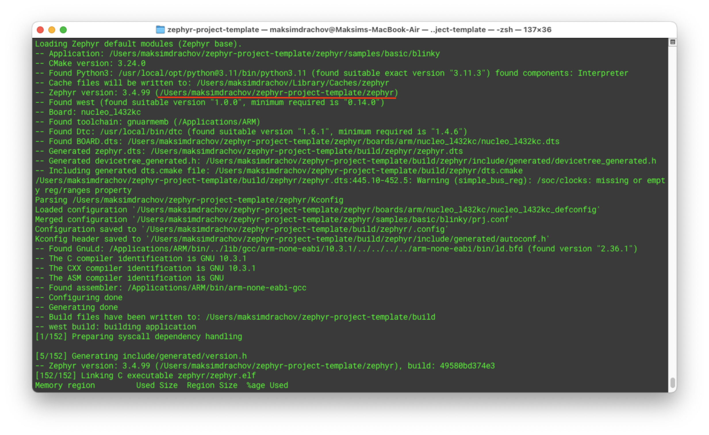

# Devops for a Zephyr RTOS project

## Introduction

Before digging into the details, this is a high-level overview of our CI setup:


As you can see in the image above, it consists of 3 parts:

1. *local*: a Macbook Air in my case.
2. *server*: any old desktop should do!
3. *Github repo*: lives in some Microsoft server park?

Now as you might notice, this setup requires you to have 2 boards instead of 1. This is not strictly necessary: it is perfectly possible to `ssh` into the server setup while you're sipping a cocktail in the Bahamas (*"work"* from *"home"*, amirite?) and flash/debug the board in this way. The only real downside is that sometimes it might be necessary to connect some oscilloscope, measure some voltage or make some other adjustment to the setup requiring to physically interact with the server setup (*who is working on this?*).

Note: I'm assuming you have already set up the Zephyr toolchain, as well as have some familiarity with how it works. If this is not the case, you should probably check out Zephyr's [Getting Started Guide](https://docs.zephyrproject.org/latest/develop/getting_started/index.html).

With that preamble out of the way, let's get down to business.

## 1. Set up the repository

Relevant documentation:

- [West: Basics](https://docs.zephyrproject.org/latest/develop/west/basics.html)
- [Application Development](https://docs.zephyrproject.org/latest/develop/application/index.html)
- [Workspaces](https://docs.zephyrproject.org/latest/develop/west/workspaces.html)

As discussed in [Application Development](https://docs.zephyrproject.org/latest/develop/application/index.html), there are 3 ways to structure the project directory (as supported by `west`):

1. *repository* application

    The application is located within the Zephyr source code repository. This type of application is appropriate for developers who want to make changes or contributions to the Zephyr operating system itself.

2. *workspace* application

    The application is located within a Zephyr workspace, but outside the Zephyr repository itself. This type of application is appropriate for developers who want to build and test their application using Zephyr, but without making changes to the source code.

3. *freestanding* application

    The application is located outside a Zephyr workspace.

We will be using the second approach:

```
cd ~
mkdir zephyr-project-template
cd zephyr-project-template
git init
git remote add origin git@github.com:maksimdrachov/zephyr-rtos-template.git
```

Now the first Zephyr-specific step is creating a hidden `.west` folder that contains a `config` file:

```
cd ~/zephyr-project-template
mkdir .west
cd .west
touch config
```

`.west/config`:

```
[manifest]
path = zephyr
file = west.yml
```

What this does: it tells `west` that there's a `zephyr` folder in our project directory which contains a `west.yml` file. In turn, this file will tell `west` about other ~~garbage~~ boilerplate that will need to be fetched to set up our repository.

As you can probably guess the next step is adding Zephyr (as a submodule). However, instead of adding mainline Zephyr, I recommend using your own fork. While not ideal (it is highly recommended to not stray too far from the official Zephyr repository) however sometimes small changes will need to be made to the Zephyr code base. It makes sense to keep track of such changes in your own fork.

```
cd ~/zephyr-project-template
git submodule add https://github.com/maksimdrachov/zephyr zephyr
```

Our project directory should now look something like this:

```
.west/
  config
zephyr/
  west.yml
  #lots of zephyr files
```

Now we can run `west update` which will fetch all of necessary boilerplate.

Before we continue, let's make sure that we don't include this boilerplate in our application repository:

<details>
<summary>Copy this to `.gitignore`</summary>

```
# Prerequisites
*.d

# Compiled Object files
*.slo
*.lo
*.o
*.obj

# Precompiled Headers
*.gch
*.pch

# Compiled Dynamic libraries
*.so
*.dylib
*.dll

# Fortran module files
*.mod
*.smod

# Compiled Static libraries
*.lai
*.la
*.a
*.lib

# Executables
*.exe
*.out
*.app

# macOS
.DS_Store

# Zephyr
bootloader/
/modules/
tools/
build/
zephyr-project-template/build/
twister-out*/

# .vscode
.vscode/.cortex-debug*

# Python
venv/
__pycache__/

# scripts
scripts/platform-tests-results/
*.bin

# nox
.nox/
.pytest_cache/
.coverage*

# SonarCloud
.scannerwork/
```
</details>

If you've done everything right, `git status` should return the following:

```
$ git status
On branch main
Your branch is up to date with 'origin/main'.

Changes to be committed:
  (use "git restore --staged <file>..." to unstage)
	new file:   .gitmodules
	new file:   zephyr

Untracked files:
  (use "git add <file>..." to include in what will be committed)
	.gitignore
	.west/
```

Commit/push and you repo should look as follows:


## 2. Define a minimal template for an application

Before we continue with creating our own custom application, let's first make sure your Zephyr toolchain is set up correctly, try running the following two commands back-to-back, and make sure the LED on your board starts blinking:

```
cd ~/zephyr-project-template
west build -b <BOARD> ./zephyr/samples/basic/blinky
west flash
```

(If this is not working, I'm sorry to report: you have failed to set up the Zephyr toolchain correctly.)

Make sure `west build` is using Zephyr from your application folder:



A successful flash:


Now that the Zephyr part is set up, we can move on to creating our own custom application.

```
cd ~/zephyr-project-template
mkdir app
```

To simplify life, just copy the contents of `zephyr/samples/basic/blinky` to `/app`:

```
app/
  CMakeLists.txt
  prj.conf
  src/
    main.c
```

Now, try to build/flash from your own custom `app` directory:

```
cd ~/zephyr-project-template
rm -rf build                                            # clear the previous build
west build -b <BOARD> ./zephyr/samples/basic/blinky
west flash
```

To debug the application:

```
west debug
```

Example (using blinky, hits a breakpoint everytime the led is switched on/off):


Last but not least, it is often useful to use the serial port during debugging:

```
cd ~/zephyr-project-template
rm -rf build
west build -b <BOARD> ./zephyr/samples/hello_world
west flash
```

On my local setup (macOS) I use [CoolTerm](https://freeware.the-meiers.org/) (see [here](https://github.com/maksimdrachov/zephyr-rtos-tutorial/blob/main/docs/1-zephyr-setup/setup/mac-os.md#1-coolterm) how to setup):


On GNU/Linux, `picocom` or `minicom` can be used:

```
picocom /dev/serial/by-id/...
minicom -D /dev/serial/by-id/...
```

Windows? I don't know man, I feel sorry for you (maybe try PuTTY).

## 3. Set up a minimal unit testing template

Relevant documentation:

- [Test Framework](https://docs.zephyrproject.org/latest/develop/test/ztest.html)
- [Test Runner: Twister](https://docs.zephyrproject.org/3.2.0/develop/test/twister.html)

To save myself some time, I will quote the CEO/CTO directly here:

> The software verfication will be performed using the following utilities:
>
> - **Unit testing suites for each component of the software.** These are arranged as dedicated executable build targets, where each target executes on the target hardware with the in-circuit debugger connected. Upon execution, the unit testing suite will run the collection of unit tests and report the outcome to the host computer via the ~~semihosting~~ serial interface.
> - **Integration test suite for the production software.** This component will be implemented as a script that runs on the well-instrumented host computer with the product running the production software connected to said computer via the regular communication interfaces expected to be leveraged in the final application (e.g., CAN bus, RCPWM, etc.). The script will excite the device and verify that the response matches the expectations set forth by the datasheet and other documentation. The integration test suite should be based on PyTest.

I couldn't have said it better myself (or more complicated), thanks [Pavel](https://twitter.com/PavelKirienko).

Btw, if you're wondering what the difference is between unit and integration tests: unit tests are for testing the code base (ex: making sure the functions return the correct output receiving a given input); integration tests take place at a higher level of abstraction: we flash the MCU with our `app` code and then give it some input (from the outside) and measure the output (ex: our server sends a CAN message, which should result in some pin being set high).

Start by adding a `verification` folder to your directory:

```
zephyr-project-template/
  verification/
    unit/
      000_template/
        CMakeLists.txt
        prj.conf
        src/
          main.c
        testcase.yaml
```

Note: for your own additional unit tests, you will create additional directories (ex: `unit/001_CAN`).

Now we'd like to run this unit test on the board and get a report of the result.

First make sure the unit test can be built:

```
cd ~/zephyr-project-template
west build -b <BOARD> ./verification/unit/000_template
```

If that works (it should), we can try to run the test using `twister`:

```
cd ~/zephyr-project-template
./zephyr/scripts/twister --device-testing --device-serial /dev/tty.usbmodem142303 -p <BOARD> -T ./verification/unit/000_template/
```

(If you're interested what each argument means, see: `./zephyr/scripts/twister --help`)

If you're on macOS, you might have the following issue:


After going through a debugging rabbit hole, I can report that it can be fixed by adding the following line to `zephyr/boards/arm/nucleo_l432kc/nucleo_l432kc.yaml`:

```
identifier: nucleo_l432kc
name: ST Nucleo L432KC
type: mcu
arch: arm
toolchain:
  - zephyr
  - gnuarmemb
  - GNUARMEMB # ADD THIS
  - xtools
ram: 64
flash: 256
supported:
  - nvs
  - pwm
  - can
  - counter
  - spi
```

*(This is why it's useful to have your own Zephyr fork)*

A successful run looks like this:


`zephyr-rtos-template/twister-out/twister.log` contains a log of the test run:

```
*** Booting Zephyr OS build 49580bd374e3 ***
Running TESTSUITE template
===================================================================
START - test_template
test finished!
PASS - test_template in 0.002 seconds
===================================================================
TESTSUITE template succeeded
------ TESTSUITE SUMMARY START ------
SUITE PASS - 100.00% [template]: pass = 1, fail = 0, skip = 0, total = 1 duration = 0.002 seconds
- PASS - [template.test_template] duration = 0.002 seconds
------ TESTSUITE SUMMARY END ------
===================================================================
RunID: 2f03d0ef6b5e57071de7fc255c72967b
PROJECT EXECUTION SUCCESSFUL
```

## 4. Set up a minimal integration testing template

Now on to the second part of verification: integration tests.

As previously explained verification takes place at a higher level of abstraction, and assumes that we are interacting with our MCU from the outside (using our local computer/server). To help us with this, we will be using the PyTest framework.

Start by adding a `integration` folder to your directory (copy the files from the [repo](https://github.com/maksimdrachov/zephyr-rtos-template)):

```
zephyr-project-template/
  verification/
    unit/
    integration/
      tests/
        test_000_flash.py
      noxfile.py
      pyproject.toml
      requirements.txt
```

Now if you've done everything correctly:

```
cd ~/zephyr-project-template/verification/integration
nox --session test
```

Result:


To run a single unit test (in debug mode):

```
pytest tests/test_000_flash.py --pdb
```

If you disconnect the MCU, it should fail in the following manner:


## 5. Setting up Clang-Tidy and Clang-Format

PS: Before continuing with this section, make sure to make the following changes to Zephyr: [Every include of Zephyr is a SYSTEM include.](https://github.com/maksimdrachov/zephyr/commit/956cf9450a1695e181c6d8517759b80b40f7b43f)

Since we want to make sure that Clang works on both `app` code as well as `verification/unit`, we will need to add it as a shared CMake module (stored in `cmake/modules/ZephyrBuildConfig.cmake`). Update the relevant CMake files to include this module:
- `app/CMakeLists.txt`
- `verification/unit/000_template/CMakeLists.txt`

Now every time we do `west build` it should automatically run Clang-Tidy:

```
west build -b <BOARD> ./app
```

Setting up Clang-Format is done in a very similar way (see the CMakeLists files mentioned above).

To run Clang-Format:

```
west build -t check_format
west build -t format
```


## 6. Setting up the CI

The final step is setting up the self-hosted runner for the CI:


As you can see, I'm using a Raspberry Pi (400), the instructions on how to set up (make sure to select Ubuntu Server **64 bit**):

- [How to install Ubuntu Server on your Raspberry Pi](https://ubuntu.com/tutorials/how-to-install-ubuntu-on-your-raspberry-pi#4-boot-ubuntu-server)

Next, you'll want to install the Zephyr SDK and verify that you are able to flash a simple blinky:

- [Zephyr: Getting Started guide](https://docs.zephyrproject.org/latest/develop/getting_started/index.html)

Then you'll need to setup a self-hosted runner, Github provides clear documentation on how to do this:

- [About self-hosted runners](https://docs.github.com/en/actions/hosting-your-own-runners/managing-self-hosted-runners/about-self-hosted-runners)
- [Adding a self-hosted runner to a repository](https://docs.github.com/en/actions/hosting-your-own-runners/managing-self-hosted-runners/adding-self-hosted-runners#adding-a-self-hosted-runner-to-a-repository)

Once you have done these steps, you can start with setting up your repo to make use of this self-hosted runner.

Create a new folder called .github, which will contain the steps/actions executed by the local runner:

```
.github/
  workflows/
    main.yml
```

In `main.yml`:

```yml
name: CI pipeline - build

on:
  - push
  #- pull_request # disabled due to security consideration (but useful to enable): https://docs.github.com/en/actions/hosting-your-own-runners/managing-self-hosted-runners/about-self-hosted-runners#self-hosted-runner-security

jobs:
  build:
    runs-on: [self-hosted, framboos] # framboos = raspberry in dutch, framboos is our self-hosted runner RPI
    if: contains(github.ref, '/main')
    steps:
      - uses: actions/checkout@v3
        # with:
          # Private submodule access requires token
          # token: ${{ secrets.ACCESS_TOKEN_FOR_GITHUB }}
          # ssh-key: ${{ secrets.SSH_PRIVATE_KEY }}
      - name: Setup
        run: |
          ./scripts/setup.sh
      - name: Build
        run: |
          . venv/bin/activate
          west build -b nucleo_l432kc ./app
      - name: Check Clang-Format
        run: |
          west build -t check_format
      - name: Flash app
        run: |
          west flash
      - name: Run unit tests
        run: |
          ./scripts/run_unit_tests.sh
      - name: Run integration tests
        run: |
          . venv/bin/activate
          cd ./verification/integration
          nox --session test
          cd ../..
```


## Conclusion

Now you should be able develop your Zephyr application while having a decent CI to catch any errors/mistakes.

Other interesting blogs on this topic:

[moderndev.pl/posts/zephyr-rtos-tutorial](https://moderndev.pl/posts/zephyr-rtos-tutorial/001-devcontainers.html)

[stupid-projects.com/posts/devops-for-embedded](https://www.stupid-projects.com/posts/devops-for-embedded-part-1/)

